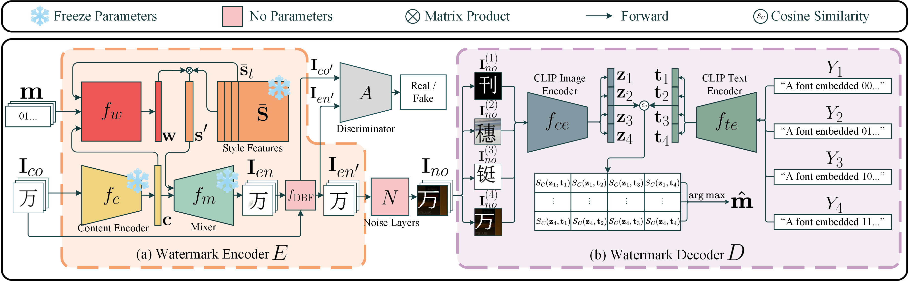

# FontGuard: A Robust Font Watermarking Approach Leveraging Deep Font Knowledge


 
## Description   
We introduce FontGuard, a novel font watermarking model that harnesses the capabilities of font models and language-guided contrastive learning. Unlike previous methods that focus solely on the pixel-level alteration, FontGuard modifies fonts by altering hidden style features, resulting in better font quality upon watermark embedding. We also leverage the font manifold to increase the embedding capacity of our proposed method by generating substantial font variants closely resembling the original font. Furthermore, in the decoder, we employ an image-text contrastive learning to reconstruct the embedded bits, which can achieve desirable robustness against various real-world transmission distortions. FontGuard demonstrates exceptional decoding accuracy under synthetic, cross-media, and OSNs distortions, which exceeds state-of-the-art methods by +15.7\%, +19.2\%, and +13.8\%, respectively. Moreover, FontGuard uniquely allows the generation of watermarked fonts for unseen fonts without re-training the network.

## Demo  
We provide the SVG files for the 1-bit watermarked SimSun fontwhich includes two variants, along with a test set collected across 7 distribution scenarios. Each scenario's test set contains 1000 segmented character images.
All the data can be found [here](https://pan.baidu.com/s/1n8z7o1pPgJpfsHl5hXP-5w?pwd=rocu) (Password: rocu).  

The data is organized as follows:  
```
|-WeChat  # test set for OSNs scenario
|---FontGuard_SimSun_16
|-Weibo  # test set for OSNs scenario
|---FontGuard_SimSun_16
|-Whatsapp  # test set for OSNs scenario
|---FontGuard_SimSun_16
|-Facebook  # test set for OSNs scenario
|---FontGuard_SimSun_16
|-print_camera  # test set for cross-media scenario
|---FontGuard_SimSun_16
|-screen_camera  # test set for cross-media scenario
|---FontGuard_SimSun_16
|-screenshots  # test set for cross-media scenario
|---FontGuard_SimSun_16
|-svg  # 1-bit watermarked SimSun SVG
|---msg_0
|---msg_1
|-bit_seq.txt  # bitstream ground truth for the test set
|-dec.pth  # decoder checkpoint
|-GB2312_CN6763.txt  # character set
```

To extract the bitstream from test set font images, first update the paths in `cfg.py`. Then, execute the following command:
```bash
python dec.py
```   
 
